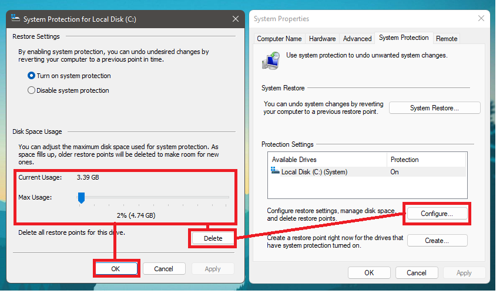
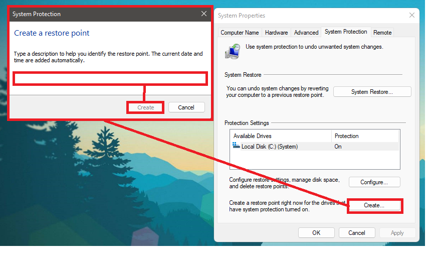
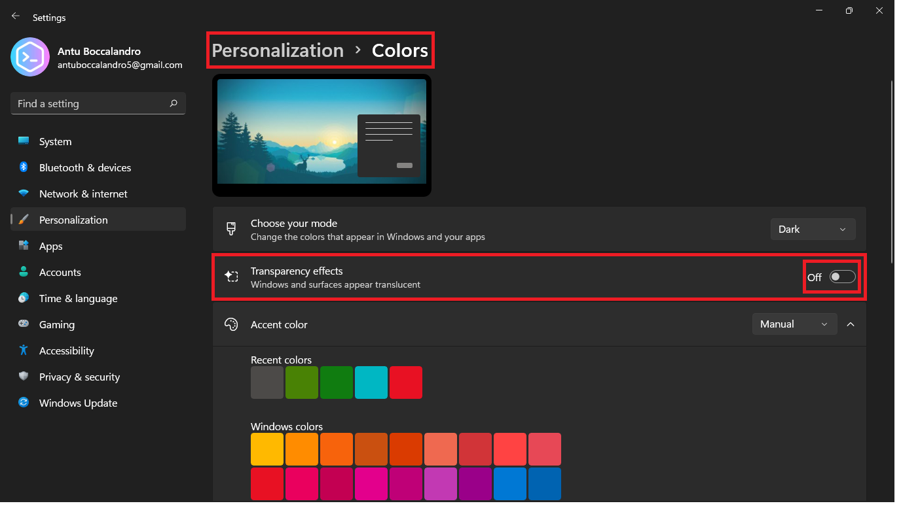
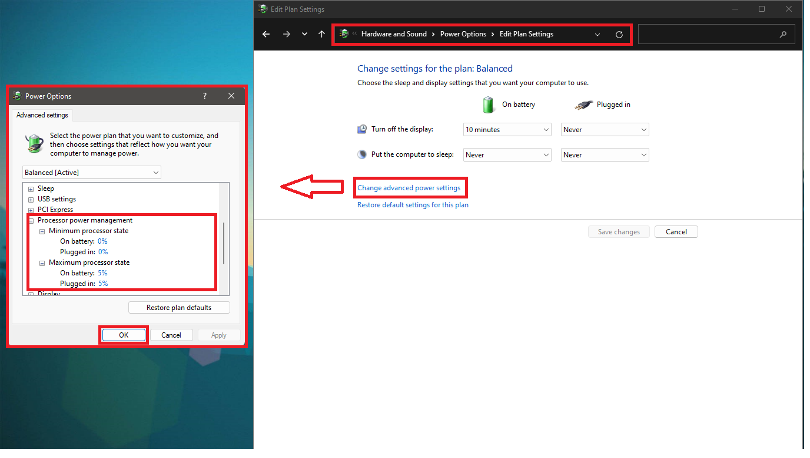
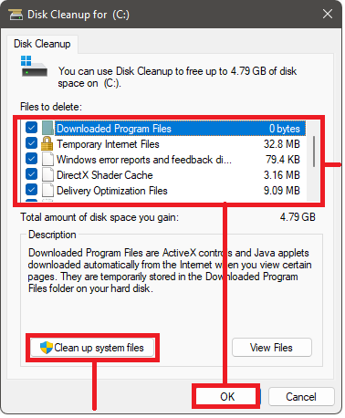

# Optimización de PC

Windows por defecto tiene varias funciones que consumen bastantes recursos, en esta serie de acciones que te mostraré harás que el rendimiento de tu PC mejore drásticamente, eso sí la experiencia visual quizá no sea la mejor claro está.

### Crear punto de restauración

Es imporatante que lo crees ya que cada vez que realizes cambios en tu computadora pueden haber fallos y los puntos de restauración sirven para que en caso de errores puedas volver atrás en os cambios de las configuraciones que has hecho.

**Configurar punto de restauración**: en la barra de búsqueda de Windows escribirás "Crear punto de restaruación", se abrirá una ventana, le das a configurar y allí primero eliminarás puntos de restaruación anteriores, luego indicarás cuanto espacio quieres que ocupe tu punto de restaruación, te recomiendo entre 20 y 50GB para un punto óptimo, esto dependrá de cuanto espacio tienes disponible. Luego le darás a aaceptar y se cerrará la ventana, crearás el punto clickeando sobre el botón "crear" y aquí colocarás el nombre de tu punto de restaruración, coloca un número significativo para identificar el punto, dale a "crear" y espera hasta que se termine de crear.

### Apariencia

**Fondo de pantalla**: iremos a la sección de personalización > fondo, y cambiaremos la opción de imagen a color sólido, si quieres puedes conservar la tu fondo de pantalla pero es recomendable si tienes una PC muy lenta cambialo a un color sólido, ya se se ve horrible pero mejorará el rendimiento.

**Efectos visuales de Windows**: iremos a la sección de sistema > acerca de, y cambiaremos las opciones del menú desplegable, estas opciones serán al gusto del usuario, como recomendación coloca la opción de "Ajustar para obtener el mejor rendimiento" auque te recomiendo que actives la opción de "Suavizar bordes de fuente" para que Windows no se vea extremadamente feo.

**Transparencias**: iremos a la sección del sistema > colores, y desactivaremos los efectos de transparencia que consume gran cantidada de recursos. 

A este punto hemos desactivado las opciones de apariencia que consumen bastantes recursos:
* Fondos
* Animaciones
* Transárencias
* ELementos visuales de Windows

### Rendimiento

**Opciones de energía**: abiremos el panel de control e iremos a la sección del panel de control Hardware y sonido > Opcione de energía > Editar plan de energía. Se nos abrirá una ventana y modificaremos las opciones de la sección del procesador para que siempre tenga el mayor rendimiento. 

**Opciones finales**: si quieres darle una optimización más profunda pero no quieres liarte abriendo ventanas, consolas o solucionando errores, te recomiendo utilizar esta herramienta. 

### Actualizaciones de Windows

### Aplicaciones y programas

**Aplicaciones en segundo plano**: las aplicaciones en segundo plano consumen basntate rendimiento, las desactivaremos todas, en Windows 10 esto era bastante más fácil, en Windows 11 lo han escondido bastante. Primero hay que buscar gpedit en el buscador de Windows, se abrirá el panel de editor de registros, abirermos un archivo llamado "Permitir a Windows ejecutar aplicaciones en segundo plano" que se encuentra en la siguiente carpeta: Configuraciones de la computadora > Plantillas Administrativas > Componentes de Windows.

Le daremos click derecho al archivo dicho y seleccionaremos la opción de editar. Ahora seleccionaremos la opción de desactivar.

**Aplicaciones de inicio**: las aplicaciones que se ejecutan a penas enciendes el ordenador hacen que este encienda muy lento, sobre todo si no tienes muchos recursos. Abrirás el panel de control con la combinación de teclas Ctrl + Shift + Esc, se abrirá el panel e irás a la sección de inicio y desactivarás todas las aplicaciones que se ejecutan al inicio de la computadora dandole click derecho al programa y desactivar. Algunas aplicaciones del sistema o procesos que veas como críticos no es necesario desactivarlos.

### Redes e internet 

### Almacenamiento

**Liberar espacio**: en el buscador de Windows escribirás liberador de espacio de disco, ahora clickearás sobre la opción de limpiar archivos del sistema. Luego volveras a abrir la ventana del liberador de espacio de disco y esta vez seleccionarás todas las casillas, con esto te aseguro que liberarás 20GB de espacio (asegurado), le das a aceptar y esperas a que se termine de liberar el espacio. 

**Limpiar carpeta de descargas**: esta carpeta es donde se descargan todos los archivos de internet, a menudo se juntan gigas de información, esto hace que esta carpeta sea un lío de archivos y pese bastnate en términos de espacio. Hay una opción en Windows que te permite util 
