# Optimización de PC

Windows por defecto tiene varias funciones que consumen bastantes recursos, en esta serie de acciones que te mostraré harás que el rendimiento de tu PC mejore drásticamente, eso sí la experiencia visual quizá no sea la mejor claro está.

## Crear punto de restauración

Es imporatante que lo crees ya que cada vez que realizes cambios en tu computadora pueden haber fallos y los puntos de restauración sirven para que en caso de errores puedas volver atrás en os cambios de las configuraciones que has hecho.

**Configurar punto de restauración**: en la barra de búsqueda de Windows escribirás "Crear punto de restaruación", se abrirá una ventana, le das a configurar y allí primero eliminarás puntos de restaruación anteriores, luego indicarás cuanto espacio quieres que ocupe tu punto de restaruación, te recomiendo entre 20 y 50GB para un punto óptimo, esto dependrá de cuanto espacio tienes disponible. Luego le darás a aaceptar y se cerrará la ventana, crearás el punto clickeando sobre el botón "crear" y aquí colocarás el nombre de tu punto de restaruración, coloca un número significativo para identificar el punto, dale a "crear" y espera hasta que se termine de crear.
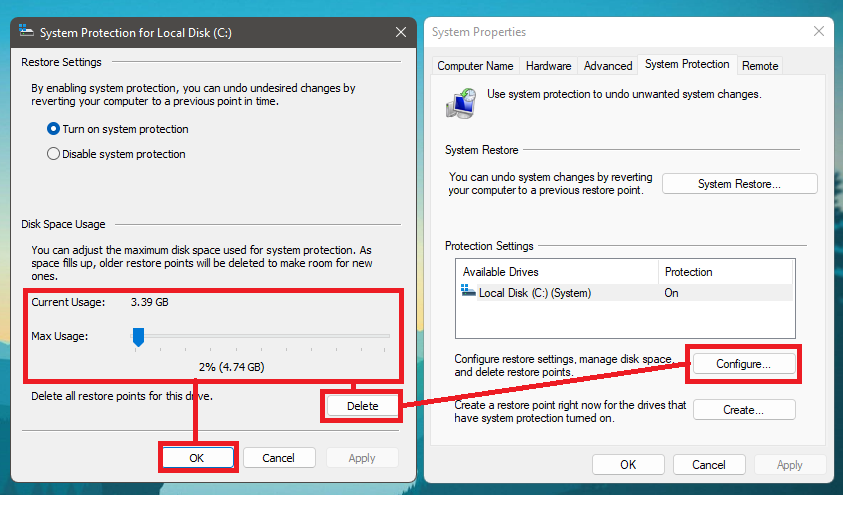
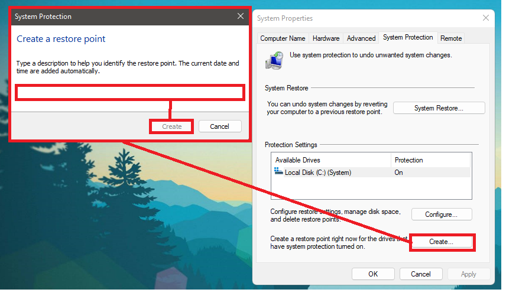

## Apariencia

**Fondo de pantalla**: iremos a la sección de personalización > fondo, y cambiaremos la opción de imagen a color sólido, si quieres puedes conservar la tu fondo de pantalla pero es recomendable si tienes una PC muy lenta cambialo a un color sólido, ya se se ve horrible pero mejorará el rendimiento.
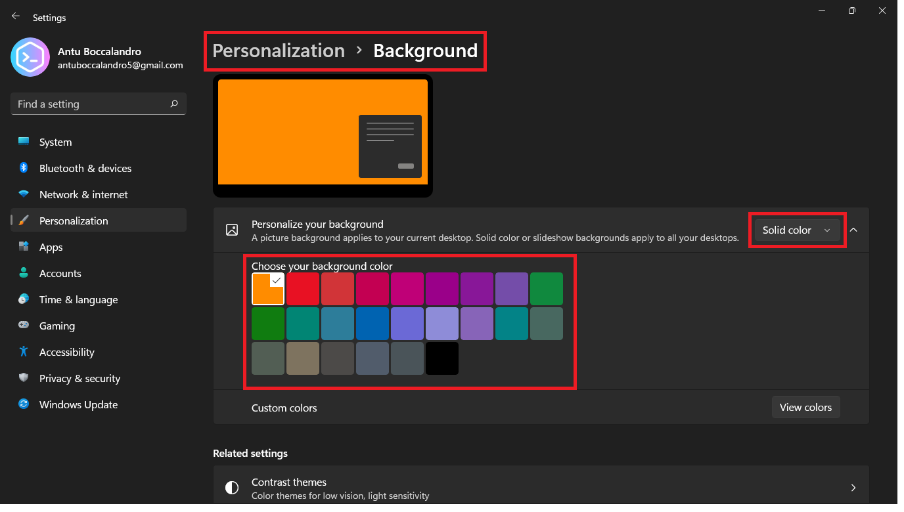

**Efectos visuales de Windows**: iremos a la sección de sistema > acerca de, y cambiaremos las opciones del menú desplegable, estas opciones serán al gusto del usuario, como recomendación coloca la opción de "Ajustar para obtener el mejor rendimiento" auque te recomiendo que actives la opción de "Suavizar bordes de fuente" para que Windows no se vea extremadamente feo.
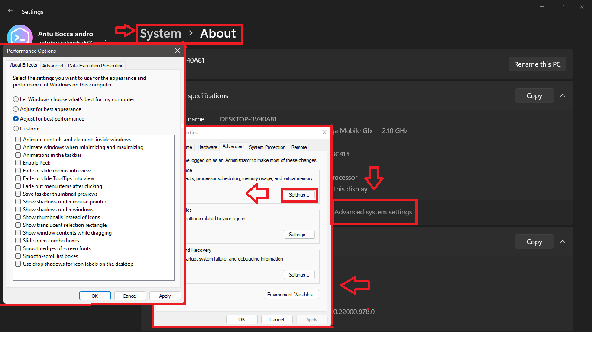

**Transparencias**: iremos a la sección del sistema > colores, y desactivaremos los efectos de transparencia que consume gran cantidada de recursos. 

A este punto hemos desactivado las opciones de apariencia que consumen bastantes recursos:
* Fondos
* Animaciones
* Transárencias
* ELementos visuales de Windows

## Rendimiento

### Actualizaciones de Windows

**Actualizar todo**: es importante que tengas el equipo actualizado a la última versión para evitar problemas en tanto a la seguridad de tu equipo. El problema es que con las actualizaciones también vienen algunos fallos de rendimiento, así que asegurate de actualizar tu equipo luego de una semana o 1 mes de que halla salido la actualización para evitar que problemas de rendimiento que incluye la nueva actualización te afecten, eso sí, actualiza y no lo dejes para dentro de 3 meses o un año. 
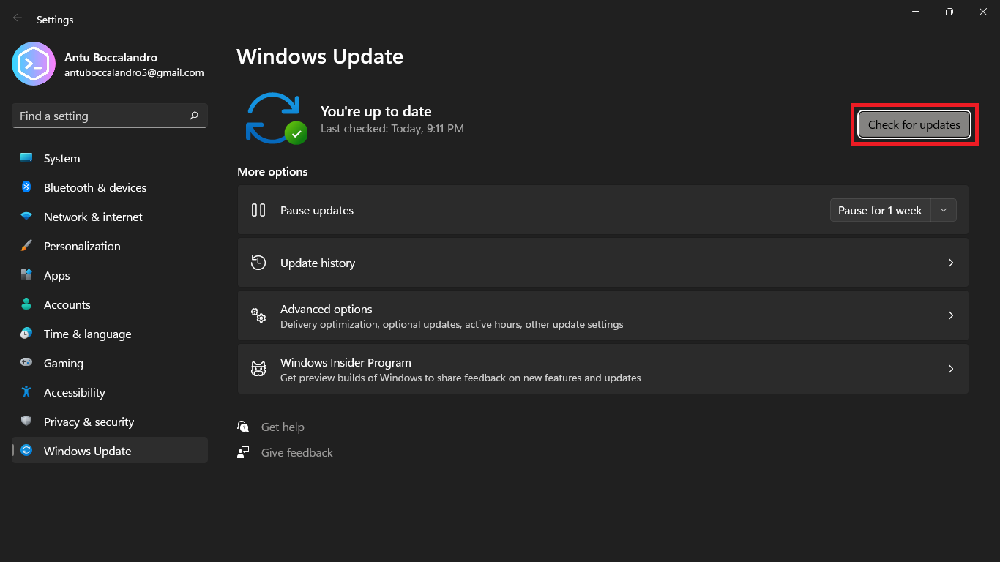

**Descargas en segundo plano**: las descargas en segundo plano de las actualizaciones suelen consumir muchos recursos y hacen que este se relentice, para ello ve escribe la combinación de teclas Windows + r y ejeuta el siguiente comando "services.msc". Esto te abrirá una ventana en la cual buscarás un archivo llamado Actualizaciones de Windows, doble click en el y se abrirá una ventana, en ella seleccionaras la opción por defecto y la cambiarás a desabiltado.
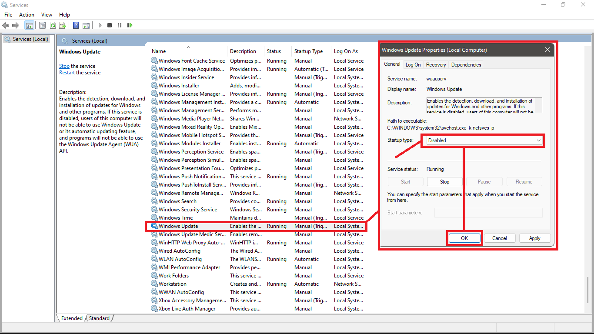

**Descargas Peer-to-peer**: las descargas Peer to peero son descargas que se realizazan sin un servidor central, lo que Microsoft planea hacer con las nuevas versiones de Windows es que las actualizaciones que descarge la gente no dependan de un servidor central si no de las propias personas, pero esto consume recursos, sobre todo de internet (ya que la computadora esta actuando a modo de servidor). Para deshabilitar esta opción debes ir a la configuración, de allí a la seección de Actualizaciones de Windows > Opciones avanzadas > Opciones de descarga, en esta parte desactivarás la opción que dice Permitir desacrgas de otros PC. 
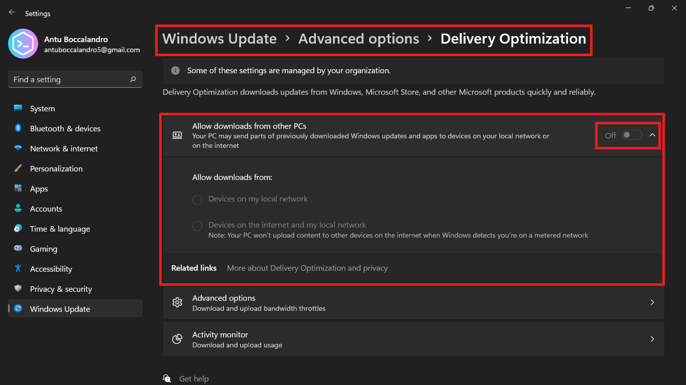

Aun deshabilitando esta opción todavía puede ser que Windows permita desacrgas de otras computadoras así que lo que haremos para asegurarnos de que no nos afecte esta opción es limitar el consumo de internet que esta pueda llegar a producir. Los valores que te recomiendo son el mínimo que admita, en este caso 5%.
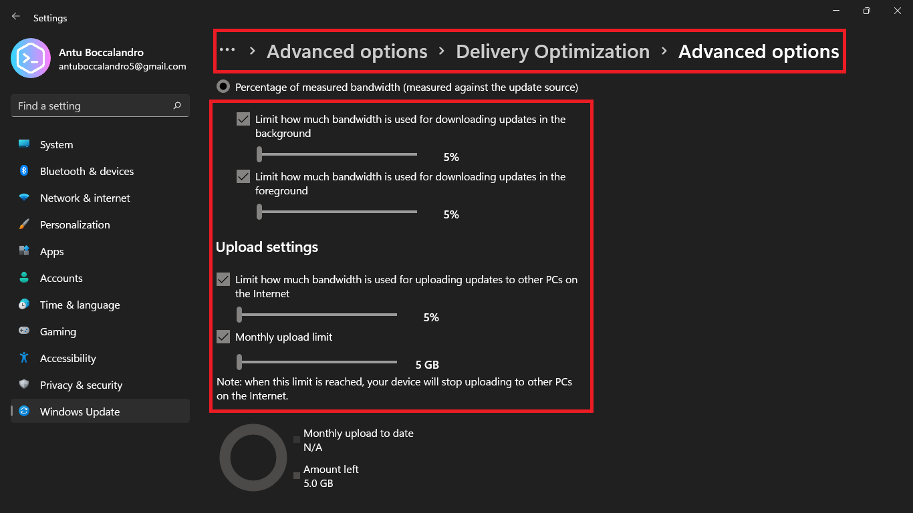

### Aplicaciones y programas

**Aplicaciones en segundo plano**: las aplicaciones en segundo plano consumen basntate rendimiento, las desactivaremos todas, en Windows 10 esto era bastante más fácil, en Windows 11 lo han escondido bastante. Primero hay que buscar gpedit en el buscador de Windows, se abrirá el panel de editor de registros, abirermos un archivo llamado "Permitir a Windows ejecutar aplicaciones en segundo plano" que se encuentra en la siguiente carpeta: Configuraciones de la computadora > Plantillas Administrativas > Componentes de Windows.
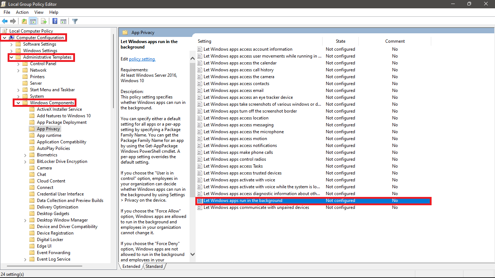
Le daremos click derecho al archivo dicho y seleccionaremos la opción de editar. Ahora seleccionaremos la opción de desactivar.
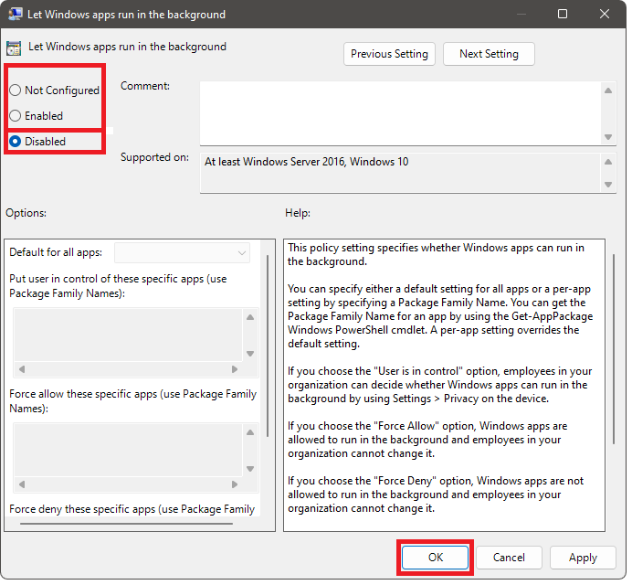

**Aplicaciones de inicio**: las aplicaciones que se ejecutan a penas enciendes el ordenador hacen que este encienda muy lento, sobre todo si no tienes muchos recursos. Abrirás el panel de control con la combinación de teclas Ctrl + Shift + Esc, se abrirá el panel e irás a la sección de inicio y desactivarás todas las aplicaciones que se ejecutan al inicio de la computadora dandole click derecho al programa y desactivar. Algunas aplicaciones del sistema o procesos que veas como críticos no es necesario desactivarlos.
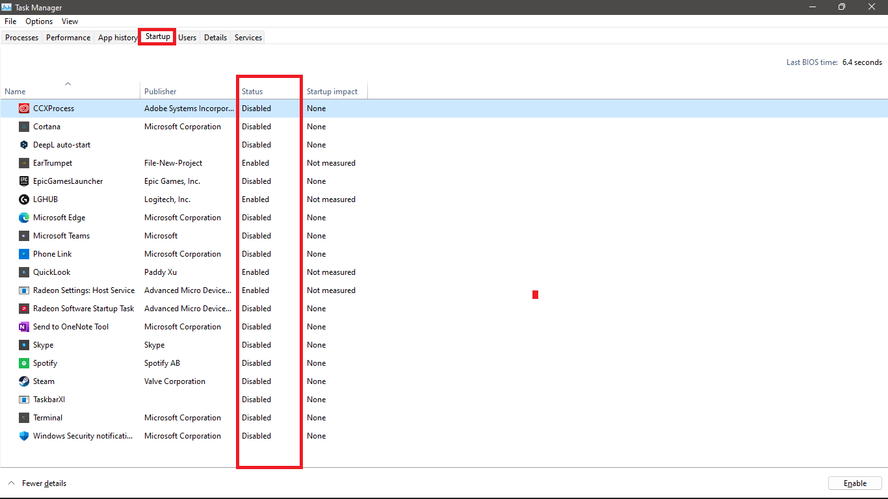

### Redes e internet 

**Configuraciones de Windows**: estos puntos ya los hemos tocado en las secciones anteriores, consiste en:
* Desactivar las aplicaciones en segundo plano
* Configuraciones de actualizaciones de Windows
  * Actualizaciones en segundo plano
  * Descargas desde otro ordenador

**Conexión medida**: la conexión medida puede hacer que no se aproveche al máximo el ancho de banda de nuestra red, para ello se puede cambiar un configuración. En la configuración de Windows en la sección de redes e internet > Wi-Fi/Ethernet > Nombre_de_tu_red (yo la censuro en la imagen por motivos de privacidad), el botón de conexión medida lo desactivarás. 
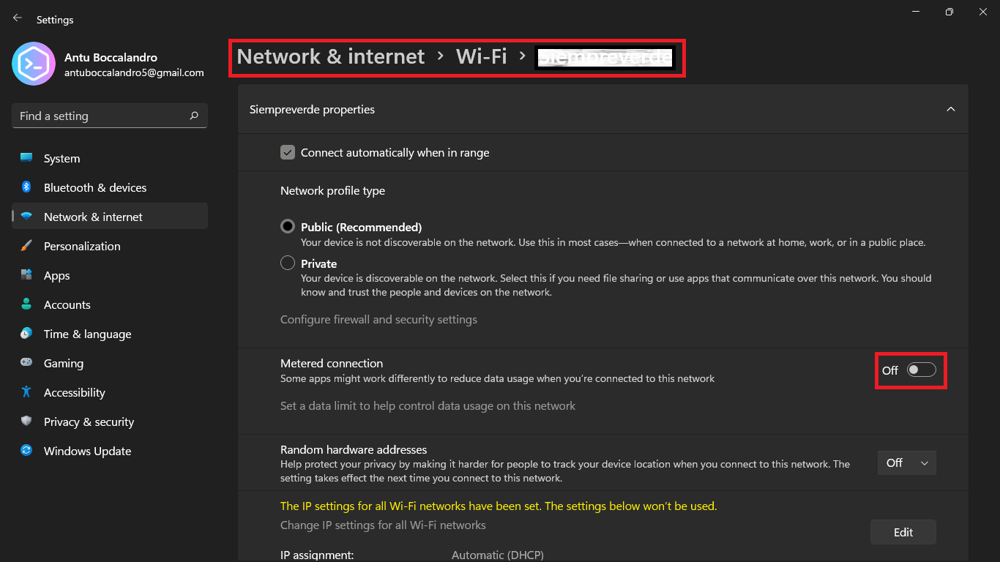

**Cambiar DNS**: si cambias el servidor DNS al que tu computadora se conecta puedes tener un incremento en la velocidad de tu internet. Para hacerlo es algo rebuscado pero funciona. Abrirás las propedades de tu red a la que te encuentras conectada, para hacerlo abrirás el panel de control e ingresarás a la sección de Redes e internet > Red y centro compartido, clickearás la red a la que estás conectado y se te abrirá una nueva ventana, en ella abirás sus propiedades, se te abrirá una nueva ventana y en ella harás doble click sobre la opción "Habilitar el protocolo de internet versión 4 (TCP/IPv4), se te abrirá una nueva ventana en la que colocarás el siguiente número en la opción de DNS preferido: 1.1.1.1, en la opción de DNS alternativo podrás el número: 1.0.0.1, le das a aceptar y cierras todas las ventanas que has abierto.
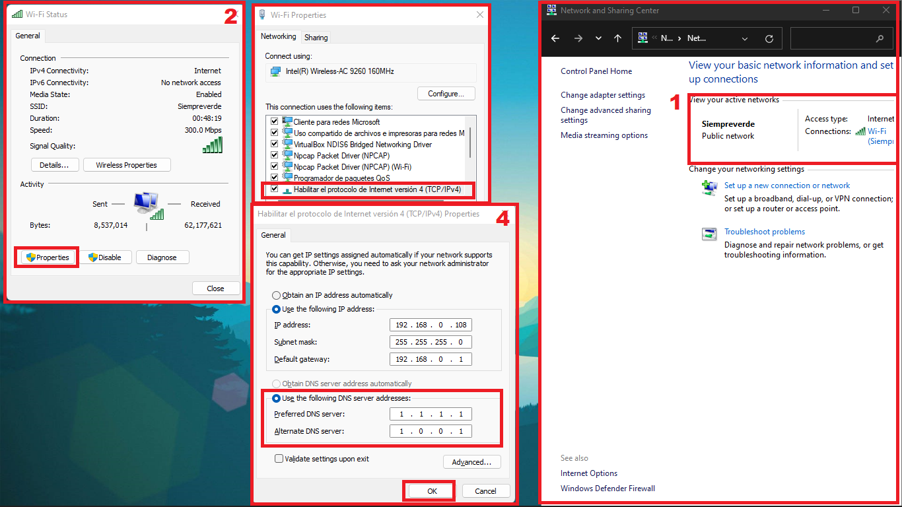

### Almacenamiento

**Liberar espacio**: en el buscador de Windows escribirás liberador de espacio de disco, ahora clickearás sobre la opción de limpiar archivos del sistema. Luego volveras a abrir la ventana del liberador de espacio de disco y esta vez seleccionarás todas las casillas, con esto te aseguro que liberarás 20GB de espacio (asegurado), le das a aceptar y esperas a que se termine de liberar el espacio. 

**Activar sensor de almacenamiento**: abre la configuración de Windows > Sistema > Almacenamiento, activarás la opción llamada "sensor de almacenamiento". Si quieres hacer configuraciones adicionales sobre esta opción te invito a ver las opciones dentro del sensor: puedes configurar cada cuanto tiempo se borran los archivos en la carpeta de descargas o en la papelera de reciclaje.
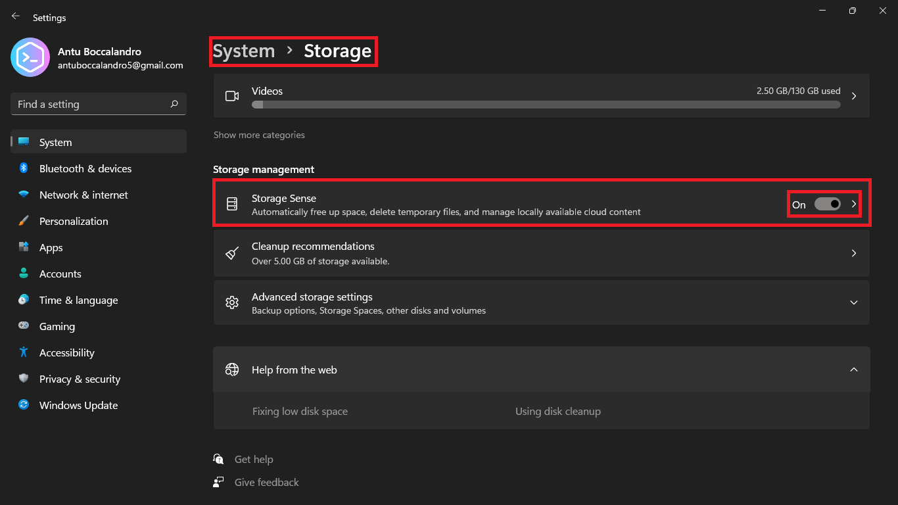

### Opciones de energía

**Opciones de energía**: abiremos el panel de control e iremos a la sección del panel de control Hardware y sonido > Opcione de energía > Editar plan de energía. Se nos abrirá una ventana y modificaremos las opciones de la sección del procesador para que siempre tenga el mayor rendimiento. 
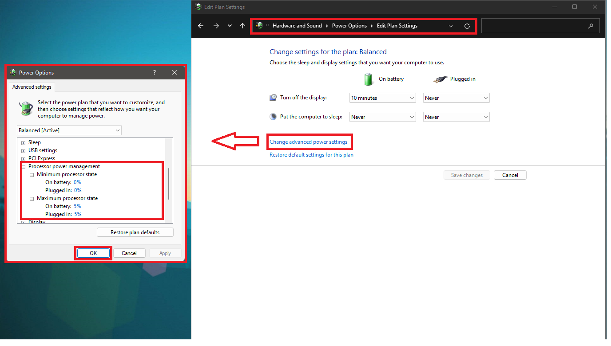

### Opciones finales

**Opciones finales**: si quieres darle una optimización más profunda pero no quieres liarte abriendo ventanas, consolas o solucionando errores, te recomiendo utilizar esta herramienta desarrollada por un conocido desarrollador de scrips de Powershell. Esta herramienta no se instala si no que se ejecuta directamente desde la terminal.
* Abre Powershell como administrador, buscala en el buscador de Windows y ejecutala como Administrador. 
* Ejecuta el siguiente script: iwr -useb https://christitus.com/win | iex

Una vez ejecutado el comando se te abrirá una ventana irás a la sección de Tweaks y seleccionas el perfil de tu PC, si tienes de escritorio elige la opción de Desktop, si tienes una laptop eligelá y si tienes una PC de muy bajos recursos la opción que dice Minimal. Una vez seleccionado tu perfil presiona el botón que dice Run Tweaks, esperas un tiempo a que se cambien las configuraciones y listo.
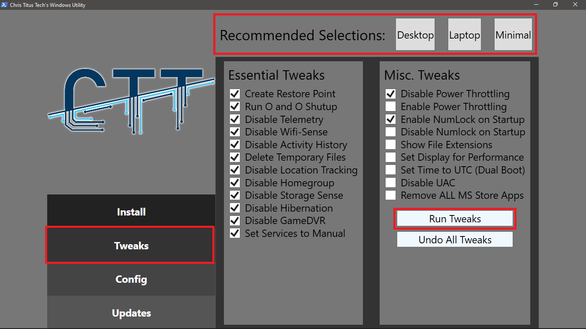

