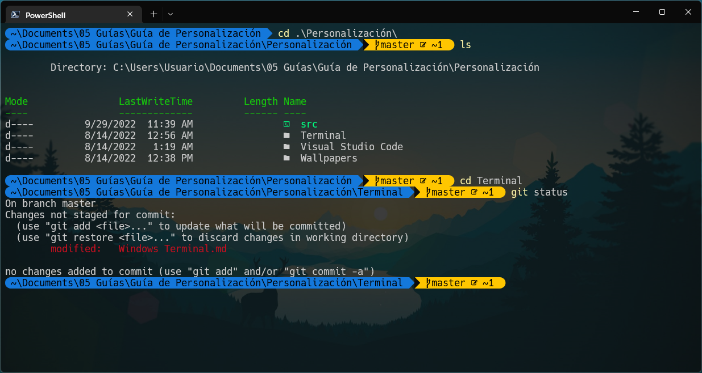

# **Windows terminal personalización**

La terminal de Windows por defecto es bastante fea, para personalizarla instalaremos una herramienta llamada Oh-my-Posh que nos permitirá personalizar la terminal de una manera sencilla. El problema de esta personalización es que en comparación de otras terminales no resulta tan rápida la respuesta que esta produce. 

#### Resumen
* Instalación de la terminal de Windows
* Instalación de Powershell 7.2, la más nueva
* Instalación de Oh-my-Posh
* Personalización de la terminal



## **Instalar herramientas**

#### Windows Terminal

```
winget install --id=Microsoft.WindowsTerminal -e
```
#### Powershell

```
winget install --id Microsoft.Powershell --source winget
winget install --id Microsoft.Powershell.Preview --source winget
```
#### Oh-my-posh
Sitio oficial de [**Oh-my-Posh**][1]

[1]: ohmyposh.dev/
```
winget install JanDeDobbeleer.OhMyPosh -s winget
```

## **Configuración de Oh-my-posh**

#### Creamos el archivo de personalización $PROFILE
```
New-Item -Path $PROFILE -Type File -Force
```
#### Abrimos el archivo
```
notepad $PROFILE
```
#### Ver los temas disponibles
```
Get-PoshThemes
```

#### Modificamos el archivo con el nombre del tema
```
oh-my-posh init pwsh --config "$env:POSH_THEMES_PATH\<nombre del tema>.omp.json"
```